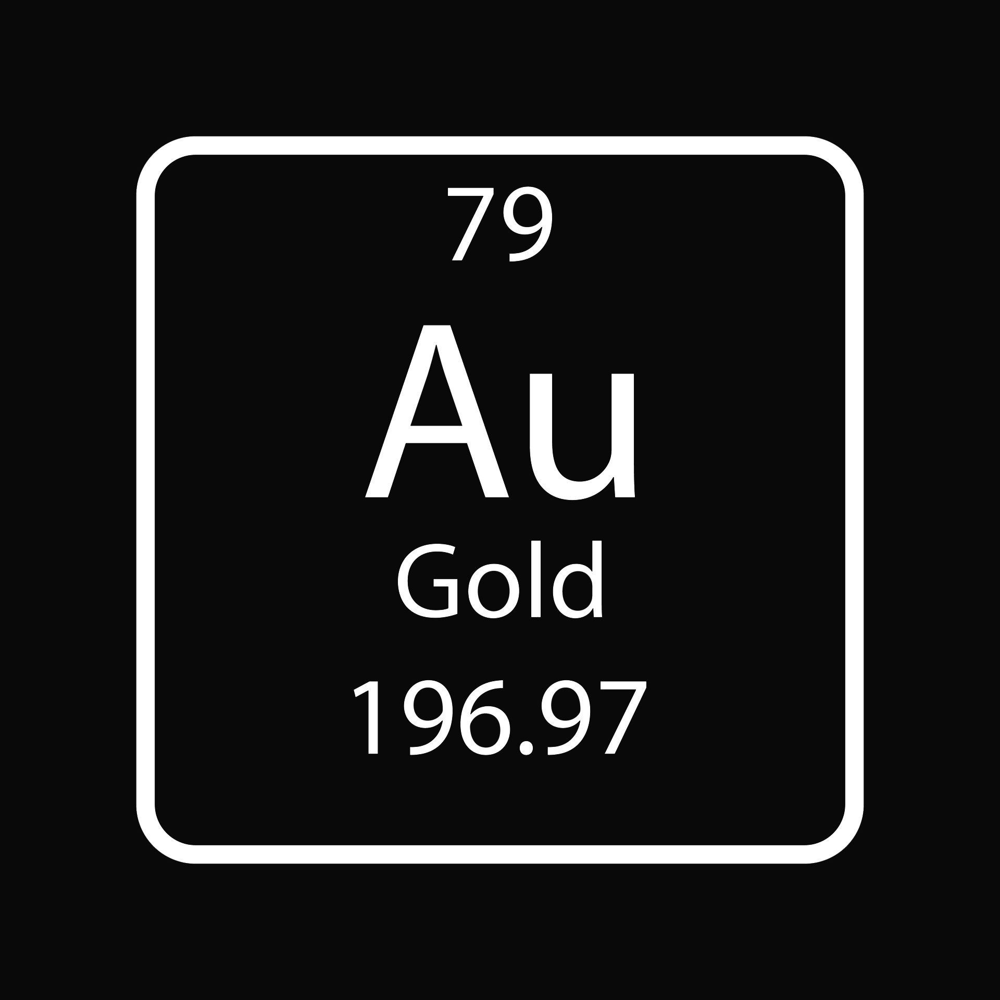

# Fundamentos de Eletricidade

## Documentação dos Meus Estudos
*Aqui registrarei tudo o que aprenderei sobre os Fundamentos de Eletricidade.*


## 1. Introdução
### Eletricidade X Eletrônica:

  - **Eletricidade** *(Engenharia Elétrica)*: Trata de altas potências e baixas frequências.

  - **Eletrônica** *(Engenharia Eletrônica)*: Lida com baixas potências e altas frequências.


## Exemplos:

### Eletricidade *(Engenharia Elétrica)*:
  1. **Torres de Transmissão de Energia Elétrica**: Responsáveis por transportar energia em altas potências das usinas para cidades e indústrias.

  2. **Painéis Solares Fotovoltaicos**: Convertem a luz solar em energia elétrica em altas potências para alimentar residências e empresas.


### Eletrônica *(Engenharia Eletrônica)*:
  1. **Computadores e Laptops**: Dispositivos eletrônicos que operam com baixas potências e altas frequências para processar informações.

  2. **Smartphones e Tablets**: Utilizam baixas potências e altas frequências para proporcionar conectividade e funcionalidades em dispositivos portáteis.

## 2. Teoria Atômica
### O que é o Átomo?
O átomo é a menor unidade básica da matéria, sendo a "blocos de construção" de tudo ao nosso redor.

Ou seja, tudo é básicamente átomo. Se pudessemos ir cortando até ver o último pedaço de algo, veriamos o átomo, porém o átomo não é visivel a olho nú e nem a microscopio. Vejamos por exemplo a água (Molécula de água), H2O, Vemos que ela possui 3 Átomos, sendo 2 deles de Hidrogênio e 1 deles é de Óxigênio.

### Composição do Átomo
#### --- Partículas ---
No desenho de um átomo, podemos ver umas particulas circulando as particulas que estão no centro, isso é a representação da Eletrosfera. A eletrosfera é uma representação simplificada da região ao redor do núcleo de um átomo, onde os elétrons são visualizados como partículas circulando em órbitas específicas. Entretanto, na realidade, os elétrons não se movem em órbitas circulares definidas. Em vez disso, eles têm comportamentos mais complexos e são descritos por orbitais, que são regiões de alta probabilidade de encontrá-los em torno do núcleo.

<div align="center">
  </img>
</div>

O átomo é composto por três partículas subatômicas principais:

  1. **Prótons**: Partículas carregadas positivamente encontradas no núcleo do átomo. Cada próton possui uma carga elétrica positiva. (Representadas em vermelho na imagem acima)

  2. **Elétrons**: Partículas carregadas negativamente que orbitam em torno do núcleo em camadas eletrônicas. Cada elétron possui uma carga elétrica negativa. (Representados em azul na imagem acima)

  3. **Nêutrons**: Partículas com carga elétrica neutra também encontradas no núcleo do átomo. Eles não possuem carga elétrica. (Representadas em branco na imagem acima)

#### --- Camadas ---
Um átomo é composto por várias camadas. Se conseguíssemos colocar um átomo, como o Átomo de Cobre, em uma mesa e observá-lo de cima, veríamos algo semelhante a isto:

<div align="center">
  </img>
</div>

Na imagem acima podemos observar que o Átomo de cobre possui 4 camadas, sendo elas chamadas de K, L, M e N, estando a K a mais próxima do núcleo e assim por diante, e caso houvesse mais camadas, elas seriam designadas como O, P, Q, etc...

Cada camada possui um nível máximo de elétrons que pode haver nela, sendo assim, o número máximo de elétrons em cada camada seria:


| Nível | Camada | N° máximo de elétrons |
|:-----:|:------:|:---------------------:|
|  1°   |   K    |           2           |
|  2°   |   L    |           8           |
|  3°   |   M    |          18           |
|  4°   |   N    |          32           |

A última camada de um átomo é denominada de "Camada de Valência" e os elétrons que estãos nesta camada também possuem um nome, sendo chamados de "Elétrons de Valência". E essa é a camada mais importante para o estudo da eletricidade pois toda interação elétrica ocorre nessa camada.

O número atômico indica quantos elétrons e quantos prótons temos neste nosso átomo, no caso do Átomo de cobre, o número atômico dele é 29, sendo assim ele possui 29 elétrons e 29 prótons. E o número de massa é possivel identificar o número de nêutrons que esse Átomo possui, o número de nêutrons corresponde a:

```
N = Nm - Na
N = 64 - 29
N = 35 nêutrons


N: Nêutrons  
Nm: Número de Massa  
Na: Número Atômico
```

#### --- Tabela Periódica ---

As informações do número atômico e do número de massas vem da tabela periódica, como mostrada na imagem abaixo:

<div align="center">
</img>
</div>

 [Clique aqui para uma melhor visualização da Tabela Periódica](https://artsexperiments.withgoogle.com/periodic-table/)

A leitura da tabela periódica é algo relativamente simples, onde as informações sobre cada elemento está logo abaixo ou acima do símbolo químico dele. Podemos ver essas informações se pegarmos o Ouro por exemplo:


| Elemento:        |  |
|:-----------------|:--:|
| Nome:            | Ouro|
| Símbolo Químico: | Au |
| N° Atômico:      | 79 |
| N° de Massa:     | aprox. 197 |

