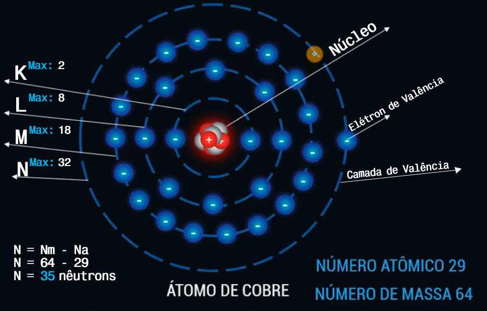
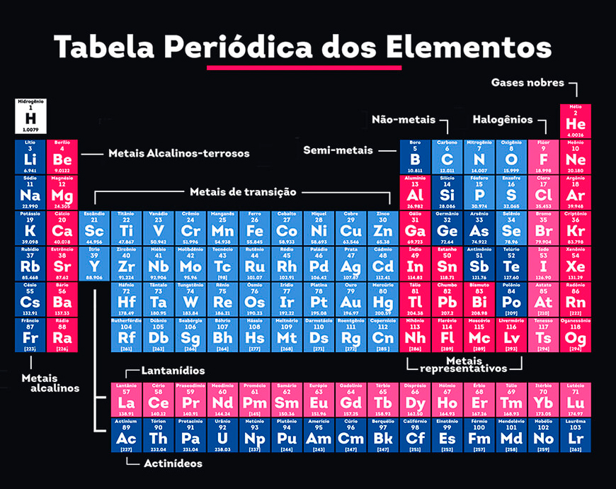
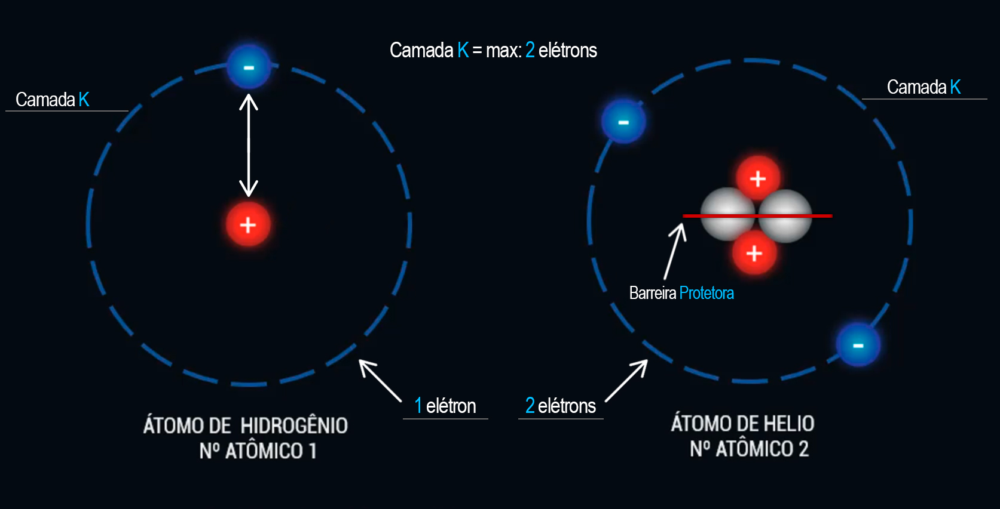

# Fundamentos de Eletricidade

## Documentação dos Meus Estudos
*Aqui registrarei tudo o que aprenderei sobre os Fundamentos de Eletricidade.*


## 1. Introdução
### Eletricidade X Eletrônica:

  - **Eletricidade** *(Engenharia Elétrica)*: Trata de altas potências e baixas frequências.

  - **Eletrônica** *(Engenharia Eletrônica)*: Lida com baixas potências e altas frequências.


## Exemplos:

### Eletricidade *(Engenharia Elétrica)*:
  1. **Torres de Transmissão de Energia Elétrica**: Responsáveis por transportar energia em altas potências das usinas para cidades e indústrias.

  2. **Painéis Solares Fotovoltaicos**: Convertem a luz solar em energia elétrica em altas potências para alimentar residências e empresas.


### Eletrônica *(Engenharia Eletrônica)*:
  1. **Computadores e Laptops**: Dispositivos eletrônicos que operam com baixas potências e altas frequências para processar informações.

  2. **Smartphones e Tablets**: Utilizam baixas potências e altas frequências para proporcionar conectividade e funcionalidades em dispositivos portáteis.

## 2. Teoria Atômica
### 2.1 O que é o Átomo?
O átomo é a menor unidade básica da matéria, sendo a "blocos de construção" de tudo ao nosso redor.

Ou seja, tudo é básicamente átomo. Se pudessemos ir cortando até ver o último pedaço de algo, veriamos o átomo, porém o átomo não é visivel a olho nú e nem a microscopio. Vejamos por exemplo a água (Molécula de água), H2O, Vemos que ela possui 3 Átomos, sendo 2 deles de Hidrogênio e 1 deles é de Óxigênio.

### 2.2 Estrutura Atômica
#### --- Partículas ---
No desenho de um átomo, podemos ver umas particulas circulando as particulas que estão no centro, isso é a representação da Eletrosfera. A eletrosfera é uma representação simplificada da região ao redor do núcleo de um átomo, onde os elétrons são visualizados como partículas circulando em órbitas específicas. Entretanto, na realidade, os elétrons não se movem em órbitas circulares definidas. Em vez disso, eles têm comportamentos mais complexos e são descritos por orbitais, que são regiões de alta probabilidade de encontrá-los em torno do núcleo.

<div align="center">
  
</div>

O átomo é composto por três partículas subatômicas principais:

  1. **Prótons**: Partículas carregadas positivamente encontradas no núcleo do átomo. Cada próton possui uma carga elétrica positiva. (Representadas em vermelho na imagem acima).

  2. **Elétrons**: Partículas carregadas negativamente que orbitam em torno do núcleo em camadas eletrônicas. Cada elétron possui uma carga elétrica negativa. (Representados em azul na imagem acima).

  3. **Nêutrons**: Partículas com carga elétrica neutra também encontradas no núcleo do átomo. Eles não possuem carga elétrica. (Representadas em branco na imagem acima).

#### --- Camadas ---
Um átomo é composto por várias camadas. Se conseguíssemos colocar um átomo, como o Átomo de Cobre, em uma mesa e observá-lo de cima, veríamos algo semelhante a isto:

<div align="center">
  
</div>

Na imagem acima podemos observar que o Átomo de cobre possui 4 camadas, sendo elas chamadas de K, L, M e N, estando a K a mais próxima do núcleo e assim por diante, e caso houvesse mais camadas, elas seriam designadas como O, P, Q, etc...

Cada camada possui um nível máximo de elétrons que pode haver nela, sendo assim, o número máximo de elétrons em cada camada seria:


| Nível | Camada | N° máximo de elétrons |
|:-----:|:------:|:---------------------:|
|  1°   |   K    |           2           |
|  2°   |   L    |           8           |
|  3°   |   M    |          18           |
|  4°   |   N    |          32           |

A última camada de um átomo é denominada de "Camada de Valência" e os elétrons que estãos nesta camada também possuem um nome, sendo chamados de "Elétrons de Valência". E essa é a camada mais importante para o estudo da eletricidade pois toda interação elétrica ocorre nessa camada.

O número atômico indica quantos elétrons e quantos prótons temos neste nosso átomo, no caso do Átomo de cobre, o número atômico dele é 29, sendo assim ele possui 29 elétrons e 29 prótons. E o número de massa é possivel identificar o número de nêutrons que esse Átomo possui, o número de nêutrons corresponde a:

```
N = Nm - Na
N = 64 - 29
N = 35 nêutrons


N: Nêutrons  
Nm: Número de Massa  
Na: Número Atômico
```

#### --- Tabela Periódica ---

As informações do número atômico e do número de massas vem da tabela periódica, como mostrada na imagem abaixo:

<div align="center">

</div>

 [Clique aqui para uma melhor visualização da Tabela Periódica](https://artsexperiments.withgoogle.com/periodic-table/)

A leitura da tabela periódica é algo relativamente simples, onde as informações sobre cada elemento está logo abaixo ou acima do símbolo químico dele. Podemos ver essas informações se pegarmos o Ouro por exemplo:


| Elemento:        |  |
|:-----------------|:--:|
| Nome:            | Ouro|
| Símbolo Químico: | Au |
| N° Atômico:      | 79 |
| N° de Massa:     | aprox. 197 |


### 2.3 Estudo das Partículas
#### Comportamento das Partículas: *Fora do átomo*
Para estudar os comportamentos da partículas primeiramente vamos observa-las fora do átomo, simulando uma remoção das partículas de um átomo, obtemos as 3 partículas (próton, elétron e nêutron).

<div align="center">

</div>

Agora imagine dois ímãs. Quando você os aproxima com os mesmos polos, por exemplo, colocando o polo norte de um ímã próximo ao polo norte do outro, eles irão se repelir. Porém, se você aproximar um ímã ao outro com polos invertidos, ou seja, o polo norte de um ímã próximo ao polo sul do outro, eles irão se atrair.

Tendo isso em mente, as partículas funcionam de forma semelhante, vamos coloca-las em um pêndulo para melhor entendimento:

<div align="center">
  
</div>

Conforme visto acima, duas cargas com sinais iguais - positivas e positivas, ou negativas e negativas - irão se repelir. Por outro lado, cargas com sinais diferentes serão atraídas uma pela outra e permanecerão unidas; em outras palavras, cargas opostas se atraem.

#### Comportamento das Partículas: *Dentro do átomo*
Para estudarmos o comportamento das partículas dentro do átomo, analisaremos dois exemplos: o átomo de hidrogênio e o de hélio.

<div align="center">
  
</div>

Conforme observado na imagem acima, o átomo de hidrogênio possui apenas 1 próton em seu núcleo e 1 elétron em sua eletrosfera, não apresentando nêutrons.

Um detalhe crucial sobre as partículas dentro de um átomo é que a distância entre elas é mantida, mesmo havendo uma atração de cargas opostas. O elétron não se aproxima e gruda no próton; existe uma força que os mantém afastados. E se houvesse outra camada, também será mantida a distância entre a outra camada e o núcleo e assim por diante.

Em um dos átomos, podemos observar a presença de apenas um elétron em sua camada K, ao invés de dois. Essa condição não representa um problema, pois a camada K pode conter no máximo dois elétrons, mas não é obrigatório que esteja totalmente preenchida com dois elétrons. Também nesse caso, a camada K é a camada de valência, pois é a última camada desse átomo, mesmo sendo a única.

Outra coisa é, relembrando que cargas iguais se repelem, no nucleo do átomo, é possivel ver 2 partículas de cargas iguais, porém elas não se repelem, pois os nêutrons servem como se fossem uma barra de proteção entre um próton e outro, fazendo assim anular a força de repulsão entre os prótons, e também uma das explicações do porque o nêutron tem uma massa um pouco maior que o próton e elétron.


### 2.4 Cargas e Partículas

#### Lei de Coulomb:

- **Força de Atração dentre as Cargas:**  
*Cientista francês Charles Coulomb (1736 -1806)*

<div align="center">
  
</div>

Na imagem acima, de um lado podemos ver duas partículas sendo atraídas, sendo o r a distância entre elas. Temos um próton e um elétron sendo atraídos mutuamente, já do outro, podemos ver duas partículas se repelindo. A força de atração entre elas é determinada pela Lei de Coulomb, e essa mesma lei também oferece respostas para cargas que estão se afastando ou se repelindo. Charles Coulomb foi o responsável por estabelecer como calcular a força de atração ou repulsão entre essas cargas.

- **Fórmula:**
```
       Q1 × Q2
F = K ---------
          r²

Q2 e Q2 = carga em coulomb
   k    = 9 × 10⁹
   r    = distância em metros
```

Essa é a fórmula para calcular a força de atração ou repulsão entre as cargas, onde:
  
  - **F** - É a Força
  - **K** - É um número, uma constante, ele depende da região, do ambiente onde vai estar essas cargas. Nesse caso, é a do vácuo (9 × 10⁹).
  - **Q1 e Q2** - Cada partículas dessas possui uma carga, e essa carga é chamada de Q, e a unidade de medida dessas cargas é dada de Coulomb (C).
  - **r** - É a distância, em metros. (na fórmula ela está ao quadrado)

A distância entre as cargas tem uma influência gigantesca nas forças que estão envolvidas entre as cargas.

Para analisarmos a influência da distância entre as cargas, vamos considerar três situações distintas e aplicar a fórmula em cada uma delas.

<div align="center">
  
</div>

Nas situações acima, todas elas possuem o mesmo tanto de carga, 5C e 4C, o que muda é apenas a distância entre elas, que dobra a cada exemplo.

Por agora, vamos anular o K, vamos supor que ele seja 1 (K = 1), para facilitar a conta, pois o interesse não é os números e sim qual é a interação das forças entre as cargas quando temos distâncias variáveis e cargas iguais.

Agora vamos pegar a fórmula novamente e vamos ver o que acontece com a força de atração quando modificamos a distância entre as cargas:

  - Situação 1:
```
      5 × 4      20
F = --------- = ---- = 20N
        1²        1
```

Na situação 1 vemos que o resultado da força de atração entre as cargas foi de 20 Newton (N).

  - Situação 2:
```
      5 × 4      20
F = --------- = ---- = 5N
        2²        4
```

Agora na situação 2, vimos que o resultado da força de atração entre as cargas foi de 5 Newton (N).

  - Situação 3:
```
      5 × 4      20
F = --------- = ---- = 1,25N
        4²       16
```

E para finalizar, na terceira situação, o resultado foi de 1,25 Newton (N)

> *Newton é a unidade de medida de força.*


Dado as situações acima, vemos que na primeira situação o resultado foi de 20N, quando dobramos a distância entre as cargas a força diminuiu em 4 vezes resultando no valor de 5N, o mesmo vale para a terceira situação, dobramos a distância, e a força também diminuiu em 4 vezes, chegando ao valor de 1,25N. Tendo isso em mente, quanto maior a distância, menor é a força de atração entre as cargas, sendo assim, essa é uma situação indiretamente proporcional, enquanto a distância aumenta, a força de atração das cargas diminui.